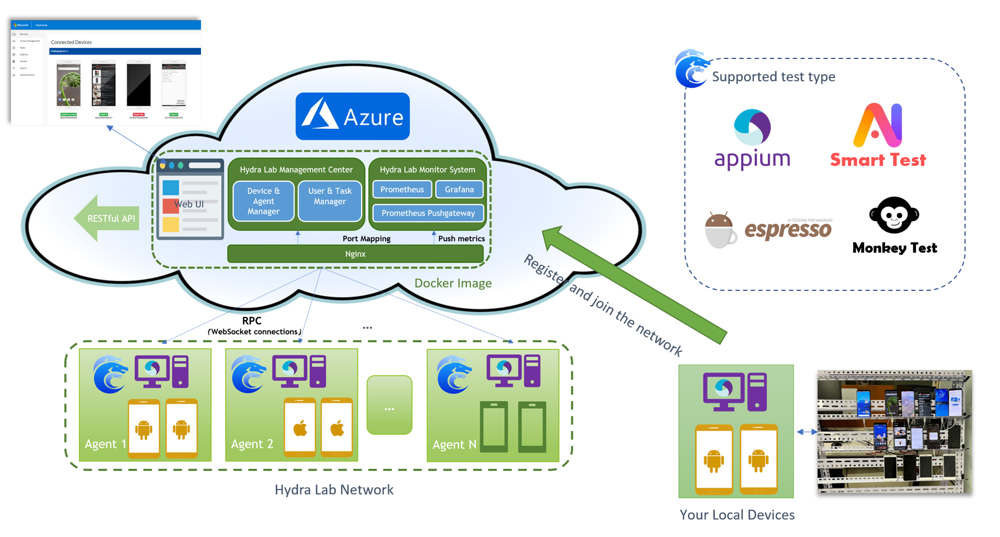

# Microsoft Hydra Lab

Build your own cloud testing infrastructure.


## What is Hydra Lab and what can it do?

The Hydra Lab is the open-source mobile app cloud testing framework that we built from scratch since mid-2021, to empower every mobile dev team to easily set up a cloud test lab utilizing the devices in hand. 

Hydra Lab enables dev team to quickly build a self-manageable and intelligent cloud testing infrastructure. With the help of Hydra Lab, you can:

- Either: Build a new cloud testing network with Hydra Lab released packages.
- Or: Onboard your test device to an existing network with low-cost and small effort.

Hydra Lab support automated test cases based on Appium(Java) for Android/iOS/Windows/Web(Browser), or Android Espresso.

And more specifically, with the help of this cloud testing infrastructure, the dev team can gain the ability to:
- Check the status & manage the connected devices.
- Upload test app binaries/packages, and then specify and deploy a test task.
- Query test results and view visuals and videos of the test run.
- Manage user permissions and access to test agent.

In short, any dev team can leverage this and quickly (within 1 week) set up a test automation infrastructure using a few local machines and real phones in hand and share it with other team to support the mobile (Android/iOS/Appium) testing workflow.

## Technical Architecture and Core Capabilities



# Getting Started

### For Contributor:

The project leverages the open source solution: [spring-dotenv](https://github.com/paulschwarz/spring-dotenv) to access and simulate environment var, so the env.* properties will be read from either your machine ENV or .env file under the resource path.

Contact Shaopeng Bu to access default test env values.

Put the .env file to the following places:
- network_agent/src/main/resources/.env
- network_center/src/main/resources/.env

#### Front end test & deployment

If you need to test the website portal, go to react_network_center_portal folder, & run:

```bash
npm install
npm run pub
```

### For Agent User:

TODO:
1. Register in the device registry center to get an agent id and agent secret, [Current Device Center Frontpage](https://hydradevicenetwork.azurewebsites.net/portal/index.html#/).
2. Set up a blob storage for your agent and configure it in the right position.
3. Download the build artifact and run it with the following args:
    - --app.registry.server=***
    - --app.registry.id=***
    - --app.registry.secret=***
    - --app.blob.connection=***

# Build, teat and run

There are 2 runnable spring boot projects.

For project network_agent, run with "**--spring.profiles.active=release**" if you want to register to the public center. This will go with the application-release.yml configuration and choose the endpoint there.

[The example Hydra Lab network front page hosted by Microsoft MaX team (AAD login required)](https://hydradevicenetwork.azurewebsites.net/portal/index.html#/)

# Basics

### 1. RPC communication:

The network_center and network_agent communicate thru websocket connection.
- In network_agent, com.microsoft.launcher.devices.socket.AgentWebSocketClient deals with the Client side connection, data transferring and scheme parsing. com.microsoft.launcher.devices.service.AgentWebSocketClientService deals with the business logic.
- In network_center, com.microsoft.devices.network.center.socket.CenterDeviceSocketEndpoint deal with serving the WebSocket clients, com.microsoft.devices.network.center.socket.CenterDeviceSocketEndpoint deals with session management, business logic and auth.

# Contribute
TODO: Explain how other users and developers can contribute to make your code better. 

If you want to learn more about creating good readme files then refer the following [guidelines](https://docs.microsoft.com/en-us/azure/devops/repos/git/create-a-readme?view=azure-devops). You can also seek inspiration from the below readme files:

# References

[Secure a Java web app using the Spring Boot Starter for Azure Active Directory](https://docs.microsoft.com/en-us/azure/developer/java/spring-framework/configure-spring-boot-starter-java-app-with-azure-active-directory)

## Contributing

This project welcomes contributions and suggestions.  Most contributions require you to agree to a
Contributor License Agreement (CLA) declaring that you have the right to, and actually do, grant us
the rights to use your contribution. For details, visit https://cla.opensource.microsoft.com.

When you submit a pull request, a CLA bot will automatically determine whether you need to provide
a CLA and decorate the PR appropriately (e.g., status check, comment). Simply follow the instructions
provided by the bot. You will only need to do this once across all repos using our CLA.

This project has adopted the [Microsoft Open Source Code of Conduct](https://opensource.microsoft.com/codeofconduct/).
For more information see the [Code of Conduct FAQ](https://opensource.microsoft.com/codeofconduct/faq/) or
contact [opencode@microsoft.com](mailto:opencode@microsoft.com) with any additional questions or comments.

## Trademarks

This project may contain trademarks or logos for projects, products, or services. Authorized use of Microsoft 
trademarks or logos is subject to and must follow 
[Microsoft's Trademark & Brand Guidelines](https://www.microsoft.com/en-us/legal/intellectualproperty/trademarks/usage/general).
Use of Microsoft trademarks or logos in modified versions of this project must not cause confusion or imply Microsoft sponsorship.
Any use of third-party trademarks or logos are subject to those third-party's policies.
