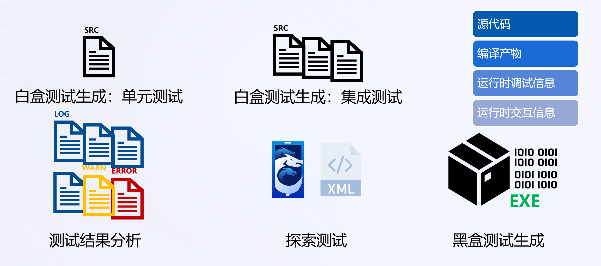
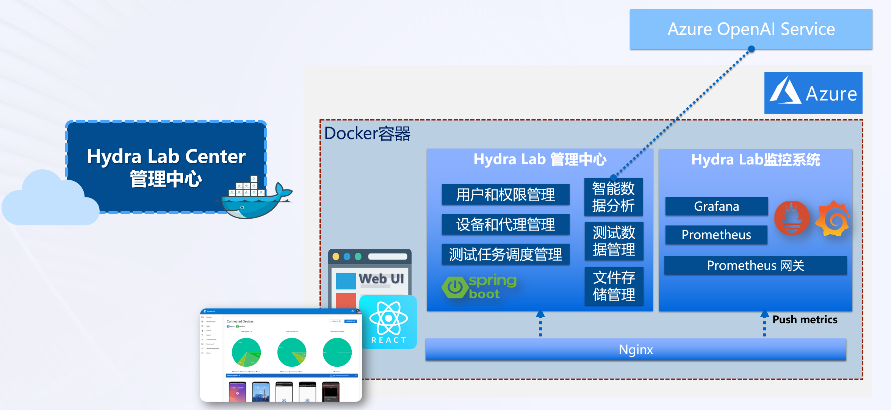
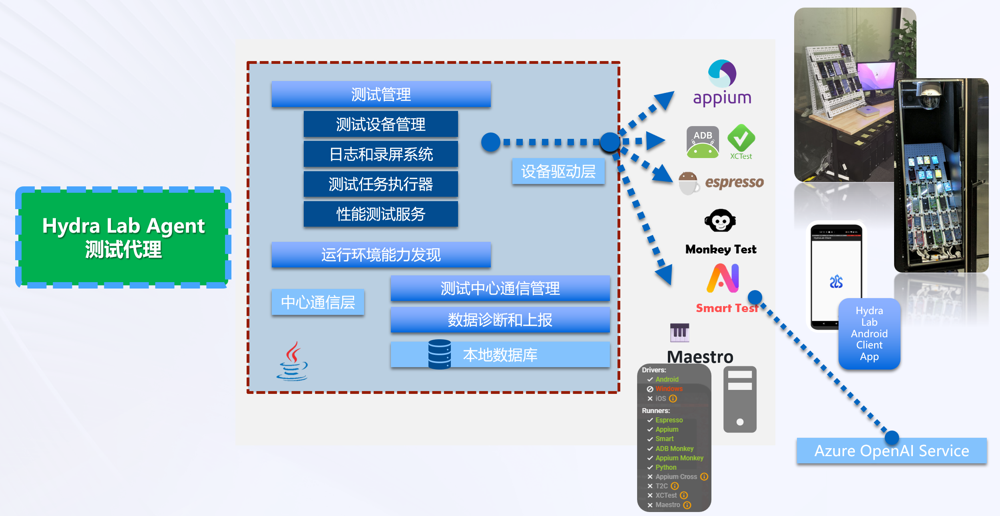
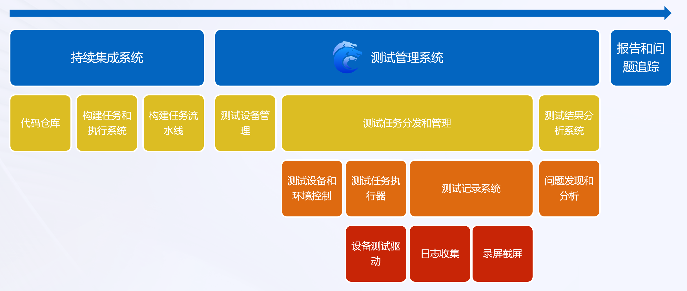

# 微软开源AI云测试平台 Hydra Lab 帮你搭建私有智能云测系统

Hydra Lab: 让智能云测试更简单！https://github.com/microsoft/HydraLab

Hydra Lab 是一个由微软开源的、支持多种测试框架和操作系统平台的智能云测试系统，利用它你可以搭建一套属于自己的测试API平台，管理你的测试设备，并在这些测试设备上运行你预定义好的测试任务。下面的这段视频详细介绍了 Hydra Lab 的功能以及定位：

https://github.com/microsoft/HydraLab/assets/26757995/b225b58e-4836-490c-a6fd-673b2a7fff40

## Hydra Lab 的优势

Hydra Lab 于 2022 年 12 月在 https://github.com/microsoft 下开源，半年多的时间就已经斩获近1000个Star，并在云测试（cloud-testing）标签下排名第一。除了设备管理，测试任务管理等基础功能外，Hydra Lab 还具备以下优势：

- **可控**：得益于 Hydra Lab 的开源属性，用户可以构建一个可管理的、私有的 “Test Lab”测试实验室，类似于"Google Firebase Test Lab"或者云测、云真机平台，这避免了将带有调试信息的应用包，上传至第三方测试平台引发的信息泄露风险，可以更好地满足内部合规要求。
- **通用**: Hydra Lab 设计之初不仅考虑到了单个设备测试的场景，还考虑到了需要同时用到多个设备的测试场景，例如跨设备办公类应用。因此 Hydra Lab 支持在Windows、Android、iOS 等类型设备上的单独测试，也支持这些设备之间的组合测试。
- **可扩展**：目前 Hydra Lab 已经集成了 Appium、 Espresso、 Maestro、 XCTest 等测试框架。由于它具备集成不同测试框架的胶水代码（适配器）、可复用可扩展的设计、软件测试生命周期的定义，所以可以快速支持新的测试框架，例如智能测试。
- **低成本**：通过 Hydra Lab 搭建测试平台，不仅可以将团队内部现有的设备接入平台，还可以与其他的团队合作，基于这个平台共享测试设备，大大减少了向第三方平台支付的测试成本。
- **集成简便**：Hydra Lab 提供 Gradle 插件 https://github.com/microsoft/HydraLab/wiki/Trigger-a-test-task-run-in-the-Hydra-Lab-test-service 、Azure Devops 插件 https://marketplace.visualstudio.com/items?itemName=MaXESteam.hydra-lab-alter 、RESTful 接口等多种方式与 DevOps 系统集成，让持续集成在测试阶段也完全自动化。
- **稳定性高**：Hydra Lab 分别集成了监控告警系统(Promethus + Grafana)、日志采集系统(AppCenter)来及时发现、定位问题，确保系统处于健康状态。同时，我们为 Hydra Lab 自身的开发建立了标准化的 CI/CD 流程，借助单元测试、接口测试、跨平台用户验收测试等环节为产品质量把关，迄今为止已经发布了 32 个稳定版本。

## Hydra Lab 基于 GPT/LLM 的智能测试探索


**如果有一百万只猴子在一百万个键盘上随机敲一百万年，就可以写出一部莎士比亚的著作。**


在软件测试领域，“猴子测试”（模拟出一只胡乱操作，按按钮不分逻辑的猴子，不间断地进行不合理的操作，随意地点击软件各个位置。如果在这种情况下下软件依旧在稳定、合理地运行，那么我们就可以说它通过了测试，是合格产品）一直是一种广受欢迎的方法，但其也存在着动作随机的局限性。如果引入**大语言模型**，创造一只更聪明的猴子，它可以真正理解应用并像人类一样与之互动，我们将能进一步提高“猴子测试”的测试覆盖率，实现更高效的智能化测试。

目前大语言模型带来的测试智能化，尤其是测试生成，大多基于白盒测试的视角，相当于把代码发给大语言模型，要求它能够写出提升代码测试覆盖率的单元测试用例。而黑盒测试下的测试远比白盒复杂，目前还属于比较前沿的探索。对于黑盒测试，代码就像一个黑盒，内部逻辑是不可见的，而且应用界面或可执行程序的包体内包括丰富的信息，“上下文”庞大，多模态，很难直接转换成 prompt。这种情况下，如何让大语言模型发挥作用？



于是我们引入了 SEE（启动-提取-评估）探索模型，它的运行方式如下：先探索，再利用。先通过一些策略探索和漫游一个软件，然后转换理解，形成数据结构，最后再利用这些数据，作为后续探索和用例生成的基础。这就相当于通过探索，对黑盒内部逻辑进行了总结提炼，完成了一次“有损压缩”。


这个思路也很像一个测试人员第一次用一个软件，一定会先探索理解，同时在旁边整理一个信息图，这在测试领域被称为“功能图”或“状态图”，然后再设计用例；这非常自然和接近人的操作。如果我们能用计算机做这件事情，就能自动化地完成探索，绘制状态图，并生成测试用例。


## Hydra Lab 技术架构简介

在过去的两年中，我们基于这个框架搭建了一个 Hydra Lab 中心服务，并集成到内部的软件开发流程中。通过 Hydra Lab 中心服务，我们为各个移动产品提供自动化测试服务，例如 Phone Link、Link to Windows for Android and iOS、Office Union for Android、Teams Android 等产品。架构图如下：




Hydra Lab 中心服务的 docker 镜像部署在 Azure 上作为测试中心，内部用户可以使用 Azure DevOps Pipeline 来创建一个 Espresso 或 Appium 类型的测试任务，并推送至测试中心。在收到测试请求后，测试中心会选择合适的测试代理和设备来运行测试任务。测试代理则会选择对应的测试框架运行任务，并在测试完成后将结果返回给测试中心。最终，用户可以在测试中心的网页上查看这些测试报告。整个流程如下图所示：



**名词定义：**

| 术语 | 缩写 | 定义 |
|----|----|----|
|Hydra Lab 中心服务| 测试中心 | Hydra Lab 中心服务是一个通过docker容器部署于**云端**的 Spring Boot 应用，提供RESTful 接口，用于分配测试任务、提供UI界面，收集并展示测试报告。 |
|Hydra Lab 测试代理服务 | 测试代理 | Hydra Lab 测试代理服务是指运行 Hydra Lab 代理服务的机器，物理连接各种测试设备，通过 WebSocket 与 Hydra Lab 中心服务保持通信。 |

注：用户可以参考 测试代理部署手册 https://github.com/microsoft/HydraLab/wiki/Test-agent-setup 配置测试服务器，并注册到 Hydra Lab 中心服务。

## 体验尝鲜

Talk is cheap, show me the code. 大家如果想快速尝试并了解 Hydra Lab 基本用法，我们提供了一键部署的 docker 镜像，只要你的机器上安装了 docker 和 ADB，输入以下命令即可端到端运行Hydra lab center + agent：

```
docker run -p 9886:9886 ghcr.io/microsoft/hydra-lab-uber:latest
```

然后打开 **http://localhost:9886/portal** ，就可以使用 Hydra Lab 的基本功能：测试设备管理，测试任务管理，使用各种测试驱动，查看测试报告，测试视频等。

关于更多的使用细节，请参考 GitHub 文档：如何部署 Hydra Lab 中心服务 https://github.com/microsoft/HydraLab/wiki/Deploy-Center-Docker-Container 。

## 加入我们

致力于“让智能云测试更简单”的目标，我们将会持续探索完善Hydra Lab，并坚信它将改变测试并助力全球开发团队。如果您有兴趣参与开发，请联系 hydra_lab_support@microsoft.com ，我们随时欢迎您加入Hydra Lab开源团队。


